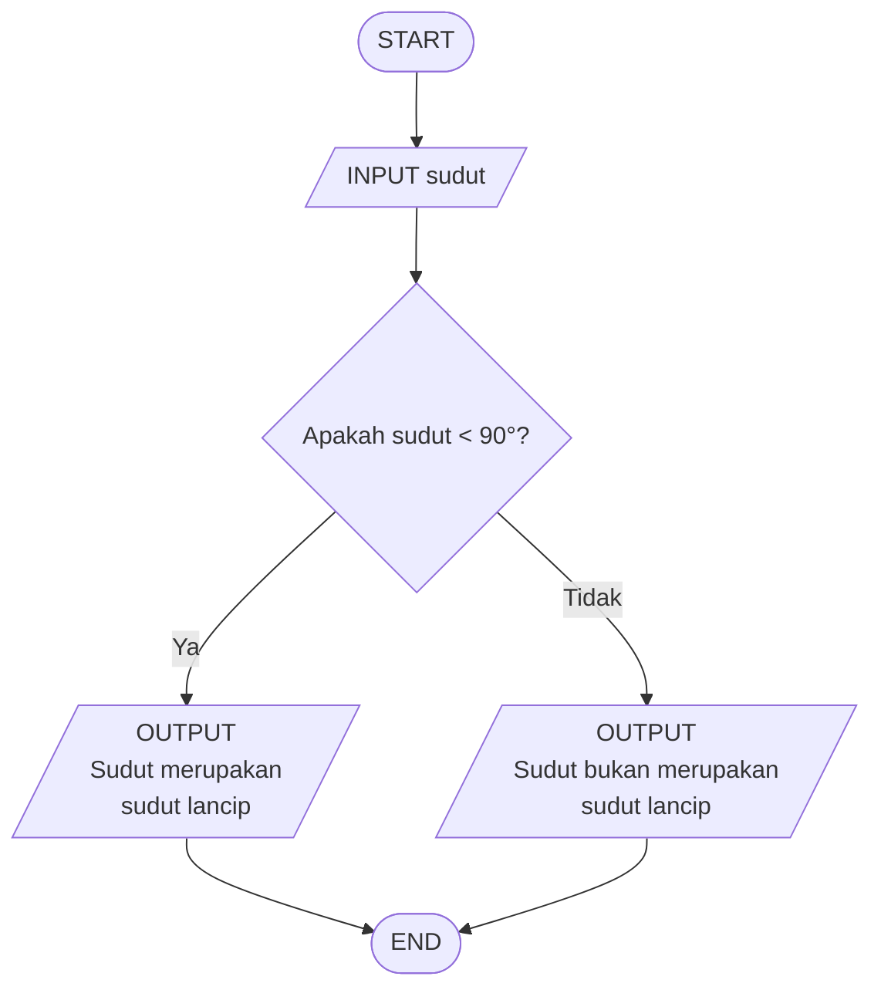

# 🧮 Logika Matematika - Menentukan Jenis Sudut

## 📝 Deskripsi Masalah

Dalam pembelajaran matematika, khususnya materi geometri, sudut dapat dibedakan berdasarkan besar ukurannya. Salah satunya adalah **sudut lancip** dan **bukan sudut lancip**.

Sudut yang memiliki besar **kurang dari 90°** termasuk sudut lancip. Sedangkan sudut yang memiliki besar **90° atau lebih** bukan merupakan sudut lancip.

Program ini menerapkan logika matematika untuk menentukan jenis sudut berdasarkan kondisi yang diberikan. Program akan menerima besar sudut sebagai input, kemudian mengevaluasi apakah besar sudut tersebut kurang dari 90° atau tidak.

Berdasarkan hasil evaluasi tersebut, program akan menentukan apakah sudut tersebut merupakan **sudut lancip** atau **bukan sudut lancip**.

---

## 📥 Input-Proses-Output

### Input
Besar sudut dalam satuan derajat.

### Proses
Program membandingkan besar sudut dengan 90°.

* Jika besar sudut kurang dari 90°, maka sudut merupakan sudut lancip.
* Jika besar sudut 90° atau lebih, maka sudut bukan merupakan sudut lancip.

### Output
Informasi mengenai apakah sudut merupakan sudut lancip atau bukan.

---

## 💻 Pseudocode

```text
INPUT sudut

IF sudut < 90 THEN
    OUTPUT "Sudut merupakan sudut lancip"
ELSE
    OUTPUT "Sudut bukan merupakan sudut lancip"
END IF
```

---

## 📊 Flowchart



---

## 🧪 Test Case

| Test Case | Input Sudut | Kondisi     | Hasil yang Diharapkan              |
| --------- | ----------- | ----------- | ---------------------------------- |
| 1         | 45°         | Sudut < 90° | Sudut merupakan sudut lancip       |
| 2         | 120°        | Sudut ≥ 90° | Sudut bukan merupakan sudut lancip |

---

## 🐍 Implementasi Python

Implementasi program dibuat menggunakan bahasa pemrograman **Python**.

Simpan source code berikut dengan nama **`main.py`**:

```python
# Program Menentukan Jenis Sudut

sudut = float(input("Masukkan besar sudut: "))

if sudut < 90:
    print("Sudut merupakan sudut lancip")
else:
    print("Sudut bukan merupakan sudut lancip")
```

---

## 📸 Hasil Pengujian

Program telah diuji menggunakan dua besar sudut sesuai dengan test case yang telah ditentukan.

### Test Case 1

**Input:**

```text
45
```

**Output:**

```text
Sudut merupakan sudut lancip
```

### Test Case 2

**Input:**

```text
120
```

**Output:**

```text
Sudut bukan merupakan sudut lancip
```

---

## ✅ Kesimpulan

Program berhasil menentukan jenis sudut berdasarkan besar sudut yang dimasukkan.

* Jika sudut **kurang dari 90°**, maka sudut merupakan **sudut lancip**.
* Jika sudut **90° atau lebih**, maka sudut **bukan merupakan sudut lancip**.

Program menghasilkan output yang sesuai dengan kondisi dan test case yang telah ditentukan.

